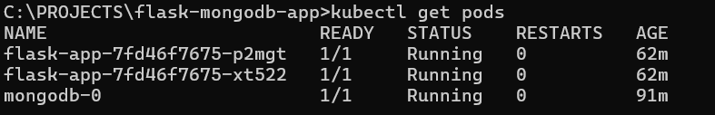
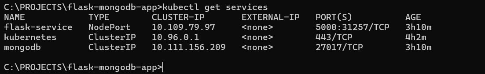
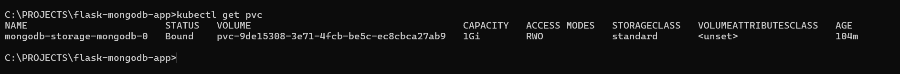
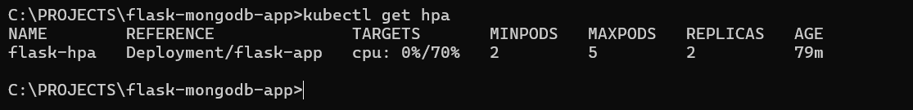
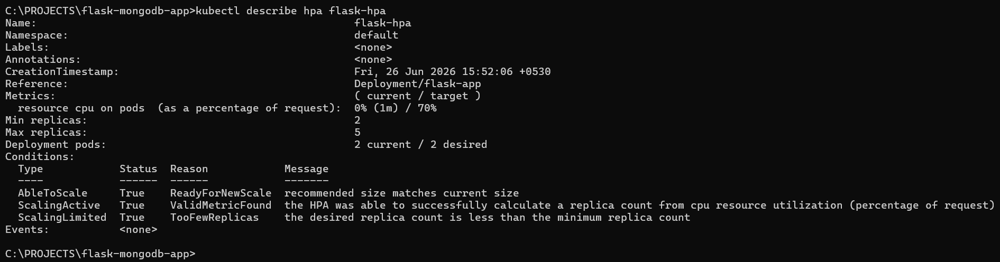
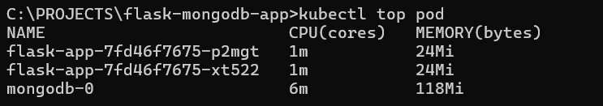
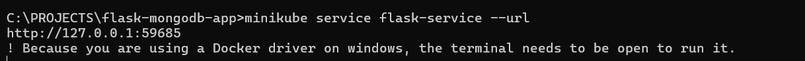
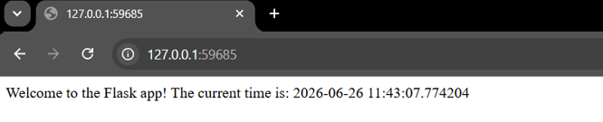

# 🚀 Flask + MongoDB on Kubernetes


---

# 📖 Project Overview

This project demonstrates the deployment of a **Dockerized Flask REST API** integrated with **MongoDB** on a **Kubernetes (Minikube)** cluster.

The application uses Kubernetes best practices including:

* Deployment with multiple replicas
* StatefulSet for MongoDB
* Persistent Volume Claims (PVC)
* Kubernetes Secrets
* ClusterIP & NodePort Services
* Horizontal Pod Autoscaler (HPA)
* CPU & Memory Resource Requests/Limits
* Kubernetes DNS Service Discovery

The objective is to build a scalable, secure, and persistent cloud-native application.

---

# ✨ Features

* 🐍 Flask REST API
* 🍃 MongoDB Database
* 🔐 MongoDB Authentication
* 📦 Dockerized Application
* ☸️ Kubernetes Deployment
* 📈 Horizontal Pod Autoscaling
* 💾 Persistent Storage (PVC)
* 🔑 Kubernetes Secrets
* 🌐 Service Discovery using Kubernetes DNS
* ⚖️ Resource Requests & Limits
* 🔄 High Availability (2 Flask Replicas)

---

# 🏗️ Architecture

```text
                        User
                          │
                          ▼
                  +----------------+
                  | NodePort Service|
                  +----------------+
                          │
            ┌─────────────┴─────────────┐
            ▼                           ▼
     +---------------+          +---------------+
     | Flask Pod #1  |          | Flask Pod #2  |
     +---------------+          +---------------+
               │                       │
               └──────────┬────────────┘
                          │
                    ClusterIP Service
                          │
                          ▼
               +----------------------+
               | MongoDB StatefulSet  |
               +----------------------+
                          │
                          ▼
              Persistent Volume Claim
```

---

# 📁 Project Structure

```text
flask-mongodb-app/
│
├── app.py
├── Dockerfile
├── requirements.txt
├── README.md
│
├── flask-deployment.yaml
├── flask-service.yaml
├── flask-hpa.yaml
│
├── mongodb-deployment.yaml
├── mongodb-service.yaml
│
└── images/
```

---

# 🛠️ Technologies Used

| Technology | Purpose                  |
| ---------- | ------------------------ |
| Python     | Backend                  |
| Flask      | REST API                 |
| MongoDB    | Database                 |
| Docker     | Containerization         |
| Kubernetes | Container Orchestration  |
| Minikube   | Local Kubernetes Cluster |
| kubectl    | Kubernetes CLI           |

---

# 📦 Prerequisites

* Docker
* Kubernetes / Minikube
* kubectl
* Python 3.8+
* Git

---

# 🐳 Build Docker Image

```bash
docker build -t flask-mongodb-app .
```

### Using Minikube Docker Environment

```cmd
FOR /f "tokens=*" %i IN ('minikube -p minikube docker-env --shell cmd') DO @%i

docker build -t flask-mongodb-app .
```

---

# ☁️ Push Image to Docker Hub

Login

```bash
docker login
```

Tag Image

```bash
docker tag flask-mongodb-app <dockerhub-username>/flask-mongodb-app:latest
```

Push Image

```bash
docker push <dockerhub-username>/flask-mongodb-app:latest
```

Update the deployment image:

```yaml
image: <dockerhub-username>/flask-mongodb-app:latest
imagePullPolicy: Always
```

---

# 🔐 Create Kubernetes Secret

```cmd
kubectl create secret generic mongodb-secret ^
--from-literal=username=admin ^
--from-literal=password=password
```

---

# 🚀 Deploy the Application

```bash
kubectl apply -f mongodb-service.yaml
kubectl apply -f mongodb-deployment.yaml

kubectl apply -f flask-deployment.yaml
kubectl apply -f flask-service.yaml

kubectl apply -f flask-hpa.yaml
```

---

# 🔍 Verify Deployment

```bash
kubectl get pods

kubectl get services

kubectl get pvc

kubectl get hpa

kubectl top pod
```

---

# 🌐 Access the Application

```bash
minikube service flask-service --url
```

Example Output

```
http://127.0.0.1:59655
```

---

# 📡 API Endpoints

### Home

```
GET /
```

Response

```
Welcome to the Flask app! The current time is...
```

---

### Insert Data

```
POST /data
```

Example

```json
{
    "sampleKey":"FinalTest"
}
```

---

### Retrieve Data

```
GET /data
```

Example Response

```json
[
   {
      "sampleKey":"FinalTest"
   }
]
```

---

# 🌐 Kubernetes DNS Resolution

The Flask application connects to MongoDB using the Kubernetes Service name:

```
mongodb
```

Instead of using an IP address, Kubernetes automatically resolves the service name through its internal DNS service.

```
Flask Pod
     │
     ▼
mongodb
     │
     ▼
ClusterIP
     │
     ▼
MongoDB Pod
```

This approach provides reliable service discovery even when pod IP addresses change.

---

# 📊 Resource Management

Resource Requests reserve the minimum CPU and Memory required by a container.

Resource Limits prevent containers from consuming excessive resources.

Configured Values

| Resource | Request | Limit |
| -------- | ------- | ----- |
| CPU      | 200m    | 500m  |
| Memory   | 250Mi   | 500Mi |

These values improve scheduling, cluster stability, and enable CPU-based Horizontal Pod Autoscaling.

---

# 📈 Horizontal Pod Autoscaler (HPA)

Configuration

| Parameter        | Value |
| ---------------- | ----- |
| Minimum Replicas | 2     |
| Maximum Replicas | 5     |
| Target CPU       | 70%   |

Verification

```bash
kubectl get hpa
```

Example

```
cpu: 1%/70%
```

---

# 💾 Persistent Storage

MongoDB stores its data using:

* Persistent Volume Claim (PVC)
* StatefulSet
* Mounted Storage

This ensures that database data remains available even after pod restarts or recreation.

---

# 🔒 Security

MongoDB credentials are securely managed using Kubernetes Secrets.

```
Username : admin

Password : Stored as Kubernetes Secret
```

Sensitive credentials are never hardcoded inside the application.

---

# 🎯 Design Choices

| Component   | Reason                                       |
| ----------- | -------------------------------------------- |
| Deployment  | Flask is stateless and easy to scale         |
| StatefulSet | MongoDB requires stable identity and storage |
| ClusterIP   | Internal communication only                  |
| NodePort    | External access from local machine           |
| PVC         | Persistent database storage                  |
| Secret      | Secure credential management                 |
| HPA         | Automatic scaling based on CPU usage         |

---

# 🧪 Testing Scenarios

### ✅ Flask API

* Verified home endpoint
* Verified POST requests
* Verified GET requests

### ✅ MongoDB

* Authentication enabled
* Successful insertions
* Successful retrieval of stored data

### ✅ Persistent Storage

* Confirmed PVC creation
* Data persists after pod restart

### ✅ Metrics Server

Verified resource usage

```bash
kubectl top pod
```

### ✅ Horizontal Pod Autoscaler

Verified HPA configuration

```bash
kubectl get hpa
```

Output

```
cpu: 0%/70%
```

### ✅ Database Connectivity

Successfully connected Flask to authenticated MongoDB using Kubernetes DNS Service Discovery.

---

# 📌 Future Improvements

* Deploy on AWS EKS / Azure AKS / Google GKE
* Configure Ingress Controller
* Add HTTPS using TLS
* Integrate Prometheus & Grafana
* Implement CI/CD using GitHub Actions
* Deploy using Helm Charts

---

# 🎉 Project Outcome

Successfully developed and deployed a **production-style cloud-native application** using Docker and Kubernetes.

The project demonstrates:

* Containerization with Docker
* Kubernetes Deployments
* StatefulSets
* Persistent Storage
* Kubernetes Secrets
* Horizontal Pod Autoscaling
* Service Discovery
* Resource Management
* MongoDB Authentication
* Scalable REST API Deployment

# 📸 Screenshots

## 🟢 Kubernetes Pods

The Flask application is deployed with **2 replicas**, while MongoDB runs as a **StatefulSet**.



---

## 🌐 Kubernetes Services

Flask is exposed using a **NodePort Service**, while MongoDB uses a **ClusterIP Service** for internal communication.



---

## 💾 Persistent Volume Claim (PVC)

MongoDB stores its data using a Persistent Volume Claim to ensure data persists across pod restarts.



---

## 📈 Horizontal Pod Autoscaler (HPA)

The Horizontal Pod Autoscaler monitors CPU utilization and automatically scales the Flask deployment between **2 and 5 replicas** when CPU usage exceeds **70%**.



---

## 📊 HPA Details

The HPA status confirms that CPU metrics are being collected successfully and that autoscaling is active.



---

## 📉 Resource Metrics

Metrics Server provides CPU and memory usage for each pod, enabling the HPA to make scaling decisions.



---

## 🏠 Flask Application

Home page of the deployed Flask application.



---

## 📦 Database API Response

Response from the `/data` endpoint, demonstrating successful interaction with MongoDB.

